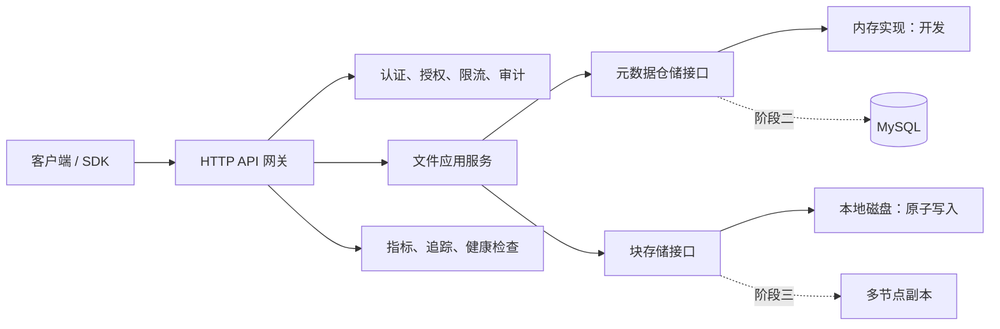

# AstraStoreXion 文件服务现代化设计

## 目标

将 AstraStoreXion 从分布式存储原型演进为易部署、可运维、可扩展的文件管理服务。首个可发布版本应提供可靠的单节点文件服务，并维持未来多节点副本、持久化元数据和多语言 SDK 的扩展边界。

目标用户是需要自建对象/文件存储能力的应用团队。该版本以 HTTP API 为主，Go SDK 为首个完整 SDK；已有 Java、Node.js、Python SDK 维持兼容并在后续版本迁移。

## 现状与基线

仓库已经有本地块存储、内存元数据、一致性哈希、Raft、JWT、Prometheus 和网关雏形，但服务之间尚未真正串联。2026-07-22 执行 `go test ./...` 的基线失败：

- `core/metaservice` 与 `core/storagenode` 缺少 `google.golang.org/grpc` 的 `go.sum` 条目。
- `pkg/monitor/prometheus.go` 将 Prometheus 接口保存为接口指针，导致 `Add`、`Set`、`Observe` 无法编译。

先修复这些阻塞项，才把后续行为变化计入本项目的测试基线。

## 方案比较

1. **直接补全多节点分布式系统**：短期覆盖面最大，但会在未验证上传语义、元数据模型和故障边界前引入大量耦合；不采用。
2. **单体文件服务 + 可替换领域接口**：先让网关、存储和元数据在一个可部署进程中闭环，再通过接口接入 MySQL、节点注册和副本调度；推荐采用。
3. **对象存储协议优先（S3 兼容）**：生态兼容性最佳，但签名、分段上传和权限模型复杂，适合作为稳定 API 后的独立阶段；后续采用。

## 架构

文件应用服务是唯一协调上传、读取、删除和元数据状态的组件。HTTP 处理器只解析请求与映射响应；存储层只负责安全地读写块；元数据仓储只负责状态持久化。这避免把 HTTP、磁盘路径和副本策略混在一起。

## 首期功能范围（v0.1）

### 文件 API

- `POST /api/v1/files`：流式上传，支持 `X-File-Name`、`Content-Type`，返回 `id`、文件名、大小、SHA-256、创建时间和下载 URL。
- `GET /api/v1/files/{id}`：下载文件，设置安全的内容类型、长度与下载文件名。
- `GET /api/v1/files/{id}/status`：返回文件元数据及完整性状态。
- `DELETE /api/v1/files/{id}`：幂等删除；删除数据块和元数据。
- `GET /api/v1/files`：按创建时间稳定排序、分页列出文件。
- `GET /health` 与 `GET /ready`：分别反映进程存活和依赖可用性。

文件 ID 由服务端生成；客户端提供的文件名仅作为显示元数据，绝不能拼接为磁盘路径。所有块键必须校验为服务端受控字符集。上传采用临时文件 + `fsync` + 原子重命名；若元数据创建失败，必须清理已写入的数据。

### 元数据模型

在现有 `FileMetadata` 上补充 `Name`、`ContentType`、`Size`、`Checksum`、`Status`、`DeletedAt`。状态为 `uploading`、`ready`、`deleting`、`deleted`；外部读取仅允许 `ready`。列表必须返回确定性排序并且不得泄露可变内部切片。

### 安全与运维

- JWT 认证保留，但默认开发模式明确标记；生产启动必须通过环境变量提供非默认密钥。
- 所有文件请求经过身份验证，管理员/普通用户权限由现有授权器扩展；文件记录保存 owner ID。
- 请求体上限、超时、统一 JSON 错误结构、请求 ID 与访问审计日志为首期必备。
- Prometheus 指标覆盖请求数、延迟、活跃请求、上传字节、存储失败和当前文件数。

### 易部署

- `docker compose up --build` 可以启动最小服务；数据卷、端口、JWT 密钥、最大上传大小均由环境变量配置。
- Makefile 提供 `build`、`test`、`lint`、`run`、`compose-up`、`compose-down` 等一致入口。
- README 包含五分钟启动、curl 示例、数据目录、升级与备份说明。

## 后续阶段

| 阶段 | 交付内容 | 完成标准 |
| --- | --- | --- |
| 0 | 构建与测试基线 | `go test ./...`、`go vet ./...`、镜像构建通过 |
| 1 | v0.1 文件核心与 Compose | 新增 API 的单元/集成测试、全新数据卷可上传下载删除 |
| 2 | 持久化元数据与后台任务 | MySQL 迁移、事务边界、删除回收、重启后数据可见 |
| 3 | 多节点可靠性 | 节点注册、三副本策略、故障读回退、再平衡任务 |
| 4 | 传输与生态 | 分片/断点续传、秒传去重、预签名 URL、SDK 完整迁移、S3 兼容评估 |
| 5 | 生产治理 | 配额、限流、审计检索、告警规则、备份恢复、基准与混沌测试 |

每个阶段均应独立可发布；不以“声明支持”替代可重复的自动化验证。

## 测试策略

- 单元测试：安全块键、状态机、元数据排序与深拷贝、鉴权规则、错误映射。
- HTTP 集成测试：上传—状态—下载—删除闭环、未知 ID、超限请求、错误校验和、并发上传。
- 容器烟囱测试：通过 Compose 启动后执行 curl/Go 客户端闭环。
- 可靠性测试（阶段三起）：节点下线时读回退、写入副本数、重平衡后校验和一致。
- 每项行为变更遵循红—绿—重构；提交前运行 `go test ./...`、`go vet ./...` 和 Docker 构建。

## Git 自动化与文档规则

仓库应通过 GitHub Actions 在所有推送与拉取请求中运行格式化检查、`go test ./...`、`go vet ./...` 和镜像构建。主分支合并后，工作流构建并推送版本化镜像；发布标签触发 changelog 和镜像发布。

“自动上传 Git”在本地开发中意味着：变更通过测试后，使用语义化提交并推送到已配置的 `origin`。自动推送不能绕过测试失败；工作流凭据使用 GitHub Actions 的短期令牌或仓库密钥，绝不写入仓库。

文档以 README 为入口，`docs/开发指南.md` 为开发手册，`docs/operations/` 为运维手册。每个 API 或部署行为变化必须在同一提交中更新相应文档和示例。

## 明确不在 v0.1 实现的内容

- 直接对外宣称 FastDFS 或 S3 协议兼容。
- 未经过恢复演练的跨地域灾备。
- 未经基准测试验证的性能指标。
- 与用户文件无关的大规模重构。
