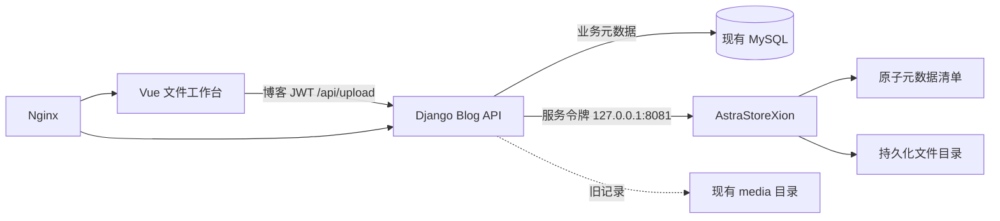

# AstraStoreXion 与 LiXD Blog 融合设计

## 目标

将 AstraStoreXion 从无法闭环的分布式原型改造成适合当前 2GB 生产服务器的轻量文件服务，并接入 `blog_li` 与 `myblog-admin`。交付完成后，管理员可在博客文件中心上传、搜索、预览、下载和删除图片或文档；新文件由 AstraStoreXion 持久化，博客继续负责 JWT、业务权限和文件记录；旧 `/media/` 文件保持可用。

本轮还必须提供面向管理员的内嵌使用教程、面向开发者的部署/回滚文档，以及可重复上传验证的 PNG、PDF、DOCX 和文本样本。

## 现状约束

- AstraStoreXion 当前网关上传、下载、状态和删除均为模拟实现，Go SDK 也是桩代码，`go test ./...` 还被 gRPC 依赖和 Prometheus 接口指针错误阻塞。
- 博客后端是 Django 5.1 + DRF + MySQL，文件字节直接写入 `/opt/blog_li/media`；前端已经有基础文件管理页并统一调用 `/api/upload/`。
- 生产机通过 Nginx 暴露 `leexd.top`，Gunicorn 仅监听 `127.0.0.1:8000`，前端采用 `/var/www/myblog-admin/releases/<commit>` 加 `current` 软链接原子发布。
- 服务器只有约 1.9GiB 内存。不能直接部署 Consul、Etcd、三存储节点、额外 MySQL、Prometheus 和 Grafana 的完整开发 Compose。
- 密码、服务令牌、Django 密钥和数据库凭据不得写入 Git、构建产物或测试样本。

## 方案比较与选择

### 方案 A：浏览器直连 AstraStoreXion

链路最短，但前端要同时管理博客 JWT 与存储凭据，还会重复实现 CORS、公开性、对象归属和令牌刷新。博客文章中的公开图片也会依赖第二个公网 API。拒绝采用。

### 方案 B：Django 认证代理 + 独立轻量存储服务

前端保持现有 API；Django 继续管理用户、权限、文件分类、标签和文章关联，仅把文件字节转交给本机 AstraStoreXion。AstraStoreXion 使用独立服务令牌、持久卷和校验和，且不暴露公网。该方案变更面最小、回滚清晰、资源占用最低，采用此方案。

### 方案 C：完整分布式栈直接上生产

扩展性最强，但当前原型尚未形成真实数据闭环，且完整栈不适合 2GB 服务器。保留为未来独立扩容阶段，不在本轮实施。

## 总体架构

浏览器永远不接触存储服务令牌。Django 根据每条文件记录的 `storage_backend` 决定走旧本地文件或 Xion；因此启用新存储不要求一次性迁移历史文件，关闭开关也不会破坏已有记录。

## 组件设计

### 1. AstraStoreXion 单节点文件服务

新增聚焦的文件应用服务，HTTP 层只负责请求解析和响应映射。存储目录按服务端生成的不可猜测 ID 保存内容，用户文件名仅作为元数据，绝不参与路径拼接。

接口如下：

- `POST /api/v1/files`：接收 multipart `file` 与可选 `metadata`，流式写临时文件，计算 SHA-256，`fsync` 后原子重命名；返回 `file_id`、文件名、大小、内容类型、校验和和创建时间。
- `GET /api/v1/files/{id}`：返回原始字节和安全的下载响应头。
- `GET /api/v1/files/{id}/status`：返回可恢复的持久元数据。
- `GET /api/v1/files`：按创建时间稳定分页，主要用于运维与 SDK。
- `DELETE /api/v1/files/{id}`：幂等删除数据与元数据。
- `GET /health`、`GET /ready`：分别报告进程存活和存储目录可写。

除健康检查外，所有路由都要求 `Authorization: Bearer <service token>`。令牌通过环境变量提供并以常量时间比较。上传体积由 `XION_MAX_UPLOAD_BYTES` 控制，默认 50MiB。错误统一为 `{"error":{"code":"...","message":"..."}}`。

元数据使用每文件 JSON 清单与原子重命名持久化，不引入新的数据库进程；重启后通过清单恢复。损坏或不完整清单不会让进程崩溃，而会在就绪检查和日志中报告。

### 2. Python 客户端

博客后端通过仓库内 Python SDK 访问 Xion。客户端增加服务令牌、结构化异常、连接/读取超时、流式下载以及仅对安全请求重试。上传失败不盲目自动重试，以免产生重复对象；调用方可以凭业务事务决定是否补偿。

SDK 对外提供 `upload_file`、`download_file`、`delete_file`、`get_file_status`、`list_files` 与 `health`。所有响应模型必须接受服务真实字段，不再依赖模拟 `success/message`。

### 3. Django 双存储适配

`UploadFile` 增加：

- `storage_backend`：`local` 或 `xion`，历史数据迁移默认 `local`；
- `storage_key`：Xion 文件 ID，可空；
- `checksum`：SHA-256，可空；
- `content_type`：真实 MIME，可空。

新增存储适配模块，定义上传、打开下载流和删除三个操作，并提供 `LocalStorageBackend` 与 `XionStorageBackend`。视图不直接拼磁盘路径或发 HTTP 请求。

当 `XION_STORAGE_ENABLED=true` 时，新上传先写 Xion，再在 MySQL 事务中创建 `UploadFile`。若数据库写入失败，调用 Xion 删除新对象；若补偿失败则记录含 storage key 的错误日志。删除时先删除物理对象，再删除数据库记录；物理对象不存在视为幂等成功。旧记录继续使用本地后端。

下载统一经过现有 Django API：私有文件保持 JWT 权限；公开文件允许博客页面读取。返回的 `file_url` 是稳定的博客 API URL，不泄露 `127.0.0.1:8081` 或服务令牌。

配置包括 `XION_BASE_URL`、`XION_SERVICE_TOKEN`、`XION_STORAGE_ENABLED`、连接/读取超时。启用 Xion 时缺少令牌必须在 Django 系统检查中失败，而不是运行到首次上传才报错。

### 4. Vue 文件工作台与教程

保留当前温暖花园视觉语言，不引入第二套 UI 框架。文件页改为响应式工作台：

- 顶部显示搜索、类型筛选、存储状态与“使用教程”；
- 提供明确的拖拽区、文件类型/大小提示、单文件进度、成功与失败结果；
- 图片使用缩略图预览，文档显示类型卡片，所有对象均可复制稳定链接、下载和删除；
- 空态、加载态、错误态和批量删除继续使用现有公共组件；
- 教程采用抽屉，覆盖“上传 → 复制链接 → 插入文章 → 下载/删除 → 常见错误”，首次进入只以非阻断提示引导，用户可随时重新打开；
- 移动端收敛为单列卡片，不依赖横向大表格完成核心操作。

前端不感知 Xion 地址和令牌，仍只调用 `/api/upload/`。上传使用 Axios 进度回调，取消与失败时恢复可操作状态。

## 数据流与失败处理

### 上传

1. Vue 预校验扩展名和大小，提交 multipart 到 Django。
2. Django 重做服务端 MIME、签名和大小校验。
3. 适配器把流上传至 Xion；Xion 原子落盘并返回 ID/校验和。
4. Django 在事务中写入文件记录并返回稳定博客 URL。
5. 第 4 步失败时执行 Xion 补偿删除。

### 下载

Django 验证公开性或用户权限，随后按 `storage_backend` 从本地打开或从 Xion 流式读取，避免把完整文件载入内存。响应保留原文件名、内容类型与长度。

### 删除

Django 先调用对应后端删除字节，再删除业务记录。Xion 的 404 视为已删除；其他网络错误保留业务记录供重试。前端只在 API 确认后移除列表项。

## 部署与回滚

- AstraStoreXion 编译为单个 Linux 二进制，由 `astrastore-xion.service` 以非 root 用户运行，监听 `127.0.0.1:8081`，数据放在 `/var/lib/astrastore-xion`。
- 服务令牌分别写入服务器受限环境文件，不提交 Git；Django 与 Xion 使用同一值。
- 发布顺序：部署并验证 Xion → 部署 Django 迁移但保持开关关闭 → 部署 Vue → 打开 Xion 写入开关 → 执行真实样本上传/下载/校验和验收。
- 回滚时先关闭 `XION_STORAGE_ENABLED` 阻止新写入，再回滚前端；已写入 Xion 的记录仍可读。只有在确认没有 Xion 记录依赖后才停止服务。
- Nginx 不增加 Xion 公网 location；现有 `/api/`、`/media/` 与前端软链接发布方式保持不变。

## 测试策略

- Go 单元测试：路径穿越、原子上传、SHA-256、重启恢复、超限、服务令牌、404、幂等删除和就绪状态。
- Go HTTP 生命周期测试：上传 → 状态 → 下载 → 列表 → 删除，字节与校验和一致。
- Python SDK 测试：认证头、字段映射、流式响应、超时和非幂等上传不重试。
- Django 测试：新旧后端路由、事务补偿、私有/公开下载、Xion 不可用、删除失败保留记录、系统配置检查。
- Vue 测试：拖拽/校验、进度、教程、稳定 URL、移动端可用结构和 API 错误恢复。
- 生产烟囱测试：上传 PNG、PDF、DOCX、TXT，下载后逐个计算 SHA-256 并与本地样本比较；最后删除专用测试记录，不动既有用户文件。

## 测试样本

样本放在 AstraStoreXion 的 `test/fixtures/generated/`，包括一张带项目标识的 PNG、一份 PDF 使用手册、一份 DOCX 部署检查单和 UTF-8 文本。每个样本均提供清单文件记录名称、MIME、大小和 SHA-256。样本不含真实凭据、个人数据或生产内容。

## 明确不在本轮范围

- 不迁移历史 `/media/` 文件；只保证双后端共存。
- 不启用多节点副本、Raft、Consul、Etcd、Grafana 或第二套 MySQL。
- 不对公网暴露 Xion，也不实现浏览器直传、S3 兼容、分片续传或 CDN。
- 不删除当前代码中的分布式实验模块；只将生产入口与它们解耦。
- 不修改服务器上与博客无关的 Afterlife、FastTunnel、Xray 或其他服务。

## 完成标准

1. 三个仓库各自的相关测试与构建通过，当前 Go 构建基线错误被修复。
2. 本地端到端测试证明四类样本上传、下载字节与 SHA-256 完全一致。
3. `leexd.top` 的博客、登录、旧媒体和管理端文件列表保持可用。
4. 生产新上传记录标记为 `xion`，Xion 仅监听回环地址，重启 Xion 与 Django 后仍可下载。
5. 使用教程、开发文档、部署/回滚步骤与真实行为一致。
6. 未提交或输出任何生产密码、服务令牌、数据库密钥或 Django 密钥。
