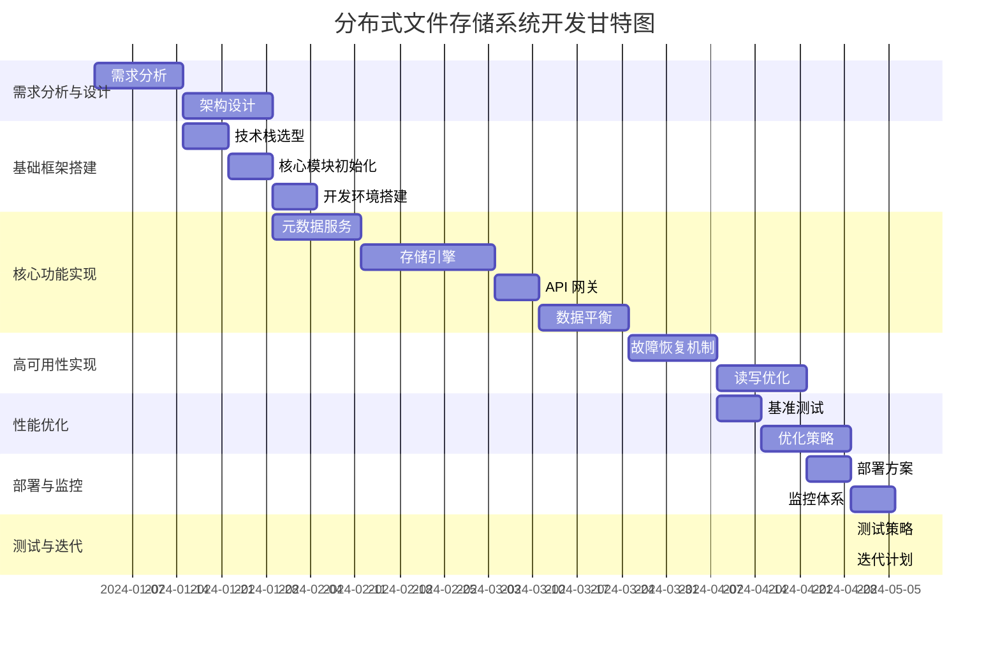
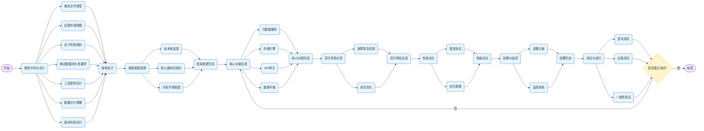

### 分布式文件存储系统开发大纲

#### 目标

- **提高网站资源加载速度**：通过优化存储架构和读写策略，减少文件访问的延迟，确保用户能够快速获取所需资源。
- **支持水平扩展**：系统应具备良好的扩展性，能够通过添加存储节点来增加存储容量和处理能力。
- **保证高可用性和数据一致性**：采用冗余存储和分布式协议，确保在节点故障时数据不丢失，并保证数据在多个副本之间的一致性。
- **实现低延迟读写**：通过优化存储引擎和网络通信，减少读写操作的响应时间。

#### 开发甘特图



#### 开发流程图

​	



### 阶段一：需求分析与设计（2 周）

#### 1. 需求分析

- 确定文件类型（图片 / 视频 / 静态资源）
  - 对网站上现有的和未来可能出现的文件类型进行详细分类，分析不同类型文件的特点，如图片的分辨率、视频的格式和码率等。
  - 考虑不同文件类型的访问频率和存储需求，为后续的存储策略制定提供依据。
- 估算存储规模（初始容量 / 增长预期）
  - 统计当前网站的文件存储总量，包括图片、视频和静态资源等。
  - 分析业务的发展趋势，预测未来一段时间内文件存储量的增长速度，考虑到业务扩张、用户增长等因素。
  - 根据增长预期，确定系统的初始容量和未来的扩展规划。
- 定义性能指标（QPS、延迟要求）
  - 与业务团队和运维团队沟通，了解网站的访问量和用户对响应时间的期望。
  - 确定系统需要支持的每秒查询率（QPS），以及不同操作（如文件上传、下载、删除）的延迟要求。
  - 考虑到高峰时段的访问压力，设置合理的性能指标。
- 确定数据持久性要求（副本数 / 纠删码策略）
  - 根据业务的重要性和数据丢失的风险，确定数据的副本数。一般来说，对于重要数据，建议设置 3 个或以上的副本。
  - 评估纠删码策略的适用性，纠删码可以在保证数据可靠性的同时，减少存储成本。根据数据的特点和性能要求，选择合适的纠删码算法。

#### 2. 架构设计

- 三层架构：接入层 / 元数据层 / 存储层
  - **接入层**：负责接收客户端的请求，并将其转发到元数据层或存储层。接入层可以采用负载均衡器来分发请求，提高系统的并发处理能力。
  - **元数据层**：管理文件的元数据信息，如文件的名称、大小、存储位置等。元数据层可以采用分布式数据库（如 Etcd/MySQL 集群）来存储元数据，确保元数据的一致性和高可用性。
  - **存储层**：负责实际的文件存储。存储层可以采用本地 SSD 存储或其他分布式存储系统，通过数据分片和副本机制来提高存储容量和数据可靠性。
- 数据分片策略：一致性哈希分片
  - 详细介绍一致性哈希算法的原理和实现方式，说明如何将文件映射到不同的存储节点上。
  - 考虑到节点的添加和删除对数据分布的影响，制定相应的节点管理策略，确保数据的均衡分布。
- 副本机制：Raft 协议实现副本一致性
  - 深入解释 Raft 协议的工作原理，包括领导者选举、日志复制和状态机更新等过程。
  - 说明如何使用 Raft 协议来实现存储节点之间的副本一致性，确保在节点故障时数据能够快速恢复。

### 阶段二：基础框架搭建（3 周）

#### 1. 技术栈选型

- 通信框架：gRPC + Protocol Buffers
  - 介绍 gRPC 的特点和优势，如高性能、跨语言支持等。
  - 说明如何使用 Protocol Buffers 来定义数据结构和服务接口，提高数据传输的效率和准确性。
- 服务发现：Consul
  - 详细介绍 Consul 的功能和工作原理，包括服务注册、发现和健康检查等。
  - 说明如何使用 Consul 来实现服务的自动发现和负载均衡，提高系统的可维护性和可用性。
- 分布式协调：Etcd
  - 深入解释 Etcd 的用途和特点，如分布式锁、配置管理等。
  - 说明如何使用 Etcd 来实现分布式系统的协调和同步，确保系统的一致性和可靠性。
- 监控：Prometheus + Grafana
  - 介绍 Prometheus 的监控原理和数据采集方式，说明如何使用 Prometheus 来收集系统的性能指标。
  - 说明如何使用 Grafana 来可视化监控数据，提供直观的监控界面，方便运维人员进行故障排查和性能优化。

#### 2. 核心模块初始化

```go
// 存储节点结构示例
type StorageNode struct {
    NodeID     string
    Address    string
    DiskQuota  int64
    DataPath   string
    RaftNode   *raft.Node
}

// 初始化存储节点
func NewStorageNode(nodeID, address string, diskQuota int64, dataPath string) (*StorageNode, error) {
    // 初始化Raft节点
    raftNode, err := initRaftNode(nodeID, address)
    if err != nil {
        return nil, err
    }

    return &StorageNode{
        NodeID:     nodeID,
        Address:    address,
        DiskQuota:  diskQuota,
        DataPath:   dataPath,
        RaftNode:   raftNode,
    }, nil
}

// 初始化Raft节点
func initRaftNode(nodeID, address string) (*raft.Node, error) {
    // 配置Raft节点
    config := raft.DefaultConfig()
    config.LocalID = raft.ServerID(nodeID)

    // 创建Raft存储
    logStore := raft.NewInmemStore()
    stableStore := raft.NewInmemStore()
    snapshotStore := raft.NewDiscardSnapshotStore()

    // 创建Raft节点
    transport := raft.NewInmemTransport(raft.ServerAddress(address))
    raftNode, err := raft.NewNode(config, nil, logStore, stableStore, snapshotStore, transport)
    if err != nil {
        return nil, err
    }

    return raftNode, nil
}
```

#### 3. 开发环境搭建

- 配置 CI/CD 流水线（GitHub Actions）
  - 详细介绍如何在 GitHub 上配置 CI/CD 流水线，包括代码编译、测试和部署等步骤。
  - 说明如何使用 GitHub Actions 的自动化脚本，实现代码的自动构建和部署，提高开发效率和代码质量。
- 容器化部署（Docker Compose）
  - 介绍 Docker 和 Docker Compose 的基本概念和使用方法。
  - 说明如何使用 Dockerfile 来构建容器镜像，以及如何使用 Docker Compose 来管理多个容器的部署和运行。

### 阶段三：核心功能实现（8 周）

#### 1. 元数据服务（2 周）

- **实现文件元数据操作**

```go
type FileMetadata struct {
    FileID    string
    ShardKey  uint32  // 一致性哈希值
    Chunks    []ChunkInfo
    CreatedAt time.Time
}

type ChunkInfo struct {
    ChunkID   string
    NodeID    string
    Offset    int64
    Size      int64
}

// 元数据服务接口
type MetadataService interface {
    CreateMetadata(fileID string, shardKey uint32, chunks []ChunkInfo) error
    GetMetadata(fileID string) (*FileMetadata, error)
    UpdateMetadata(fileID string, metadata *FileMetadata) error
    DeleteMetadata(fileID string) error
}

// 元数据服务实现
type MetadataServiceImpl struct {
    db *sql.DB
}

func NewMetadataServiceImpl(db *sql.DB) *MetadataServiceImpl {
    return &MetadataServiceImpl{
        db: db,
    }
}

func (s *MetadataServiceImpl) CreateMetadata(fileID string, shardKey uint32, chunks []ChunkInfo) error {
    // 插入元数据到数据库
    tx, err := s.db.Begin()
    if err != nil {
        return err
    }
    defer tx.Rollback()

    // 插入文件元数据
    _, err = tx.Exec("INSERT INTO file_metadata (file_id, shard_key, created_at) VALUES (?,?,?)", fileID, shardKey, time.Now())
    if err != nil {
        return err
    }

    // 插入块信息
    for _, chunk := range chunks {
        _, err = tx.Exec("INSERT INTO chunk_info (file_id, chunk_id, node_id, offset, size) VALUES (?,?,?,?,?)", fileID, chunk.ChunkID, chunk.NodeID, chunk.Offset, chunk.Size)
        if err != nil {
            return err
        }
    }

    return tx.Commit()
}

func (s *MetadataServiceImpl) GetMetadata(fileID string) (*FileMetadata, error) {
    // 查询文件元数据
    row := s.db.QueryRow("SELECT file_id, shard_key, created_at FROM file_metadata WHERE file_id =?", fileID)
    var metadata FileMetadata
    err := row.Scan(&metadata.FileID, &metadata.ShardKey, &metadata.CreatedAt)
    if err != nil {
        return nil, err
    }

    // 查询块信息
    rows, err := s.db.Query("SELECT chunk_id, node_id, offset, size FROM chunk_info WHERE file_id =?", fileID)
    if err != nil {
        return nil, err
    }
    defer rows.Close()

    for rows.Next() {
        var chunk ChunkInfo
        err := rows.Scan(&chunk.ChunkID, &chunk.NodeID, &chunk.Offset, &chunk.Size)
        if err != nil {
            return nil, err
        }
        metadata.Chunks = append(metadata.Chunks, chunk)
    }

    return &metadata, nil
}

func (s *MetadataServiceImpl) UpdateMetadata(fileID string, metadata *FileMetadata) error {
    // 更新文件元数据
    tx, err := s.db.Begin()
    if err != nil {
        return err
    }
    defer tx.Rollback()

    // 更新文件元数据
    _, err = tx.Exec("UPDATE file_metadata SET shard_key =?, created_at =? WHERE file_id =?", metadata.ShardKey, metadata.CreatedAt, fileID)
    if err != nil {
        return err
    }

    // 删除旧的块信息
    _, err = tx.Exec("DELETE FROM chunk_info WHERE file_id =?", fileID)
    if err != nil {
        return err
    }

    // 插入新的块信息
    for _, chunk := range metadata.Chunks {
        _, err = tx.Exec("INSERT INTO chunk_info (file_id, chunk_id, node_id, offset, size) VALUES (?,?,?,?,?)", fileID, chunk.ChunkID, chunk.NodeID, chunk.Offset, chunk.Size)
        if err != nil {
            return err
        }
    }

    return tx.Commit()
}

func (s *MetadataServiceImpl) DeleteMetadata(fileID string) error {
    // 删除文件元数据
    tx, err := s.db.Begin()
    if err != nil {
        return err
    }
    defer tx.Rollback()

    // 删除文件元数据
    _, err = tx.Exec("DELETE FROM file_metadata WHERE file_id =?", fileID)
    if err != nil {
        return err
    }

    // 删除块信息
    _, err = tx.Exec("DELETE FROM chunk_info WHERE file_id =?", fileID)
    if err != nil {
        return err
    }

    return tx.Commit()
}
```

- **分布式锁实现（Etcd 租约）**

```go
import (
    "context"
    "time"

    "go.etcd.io/etcd/clientv3"
)

// 分布式锁实现
type DistributedLock struct {
    client  *clientv3.Client
    key     string
    leaseID clientv3.LeaseID
}

func NewDistributedLock(client *clientv3.Client, key string) *DistributedLock {
    return &DistributedLock{
        client: client,
        key:    key,
    }
}

func (l *DistributedLock) Lock(ctx context.Context) (bool, error) {
    // 创建租约
    resp, err := l.client.Grant(ctx, 5) // 租约有效期为5秒
    if err != nil {
        return false, err
    }
    l.leaseID = resp.ID

    // 创建锁
    txn := l.client.Txn(ctx)
    txn.If(clientv3.Compare(clientv3.CreateRevision(l.key), "=", 0)).
        Then(clientv3.OpPut(l.key, "locked", clientv3.WithLease(l.leaseID))).
        Else(clientv3.OpGet(l.key))

    respTxn, err := txn.Commit()
    if err != nil {
        return false, err
    }

    return respTxn.Succeeded, nil
}

func (l *DistributedLock) Unlock(ctx context.Context) error {
    // 释放租约
    _, err := l.client.Revoke(ctx, l.leaseID)
    return err
}
```

#### 2. 存储引擎（3 周）

- 分块存储设计（4MB / 块）
  - 详细介绍分块存储的原理和优势，说明如何将大文件分割成多个 4MB 的块进行存储。
  - 考虑到块的编号和偏移量，设计合理的数据结构来管理块信息。
- **数据同步协议**

```go
// 数据写入流程
func (n *StorageNode) WriteChunk(chunkID string, data []byte) error {
    // 1. 本地写入SSD
    filePath := filepath.Join(n.DataPath, chunkID)
    err := ioutil.WriteFile(filePath, data, 0644)
    if err != nil {
        return err
    }

    // 2. Raft日志复制
    cmd := []byte(chunkID)
    future := n.RaftNode.Apply(cmd, 5*time.Second)
    if err := future.Error(); err != nil {
        return err
    }

    // 3. 提交到多数节点
    // Raft协议会自动处理多数节点的提交

    return nil
}
```

#### 3. API 网关（1 周）

- **RESTful 接口设计**

```go
package main

import (
    "net/http"

    "github.com/gorilla/mux"
)

// API网关处理函数
func main() {
    r := mux.NewRouter()

    // 文件上传
    r.HandleFunc("/v1/files", uploadFile).Methods("POST")

    // 文件下载
    r.HandleFunc("/v1/files/{id}", downloadFile).Methods("GET")

    // 文件删除
    r.HandleFunc("/v1/files/{id}", deleteFile).Methods("DELETE")

    http.ListenAndServe(":8080", r)
}

// 文件上传处理函数
func uploadFile(w http.ResponseWriter, r *http.Request) {
    // 处理文件上传逻辑
    // ...
}

// 文件下载处理函数
func downloadFile(w http.ResponseWriter, r *http.Request) {
    // 处理文件下载逻辑
    // ...
}

// 文件删除处理函数
func deleteFile(w http.ResponseWriter, r *http.Request) {
    // 处理文件删除逻辑
    // ...
}
```

#### 4. 数据平衡（2 周）

- 虚拟节点迁移算法
  - 详细介绍虚拟节点迁移算法的原理和实现方式，说明如何根据节点的负载和存储情况，动态地迁移虚拟节点，实现数据的均衡分布。
- 热点文件自动检测
  - 设计热点文件检测算法，通过统计文件的访问频率和访问时间，识别出热点文件。
  - 针对热点文件，采取相应的优化策略，如增加副本数、缓存到内存等。
- 冷数据归档策略
  - 定义冷数据的判断标准，如文件的访问时间和访问频率。
  - 制定冷数据归档策略，将冷数据迁移到低成本的存储介质上，以节省存储成本。

### 阶段四：高可用性实现（4 周）

#### 1. 故障恢复机制

- 节点心跳检测（3 秒超时）
  - 详细介绍节点心跳检测的实现方式，说明如何通过定期发送心跳包来检测节点的状态。
  - 当节点在 3 秒内没有收到心跳包时，判定该节点离线，并触发相应的故障恢复流程。
- Raft 领导者选举
  - 深入解释 Raft 领导者选举的过程，包括候选人、投票和领导者确定等步骤。
  - 说明如何处理领导者选举过程中的异常情况，如网络分区、节点故障等。
- **数据修复流程**

节点D节点A节点C协调器监控系统节点D节点A节点C协调器监控系统节点B离线启动数据修复拉取缺失分片写入副本

节点D节点A节点C协调器监控系统节点D节点A节点C协调器监控系统节点B离线启动数据修复拉取缺失分片写入副本

- 详细介绍数据修复流程的实现细节，包括监控系统如何检测节点离线、协调器如何选择修复节点、修复节点如何拉取缺失分片和写入副本等。
- 考虑到数据修复过程中的并发问题和一致性问题，采取相应的措施进行处理。

#### 2. 读写优化

- 客户端缓存策略（LRU 缓存）
  - 介绍 LRU 缓存的原理和实现方式，说明如何在客户端使用 LRU 缓存来减少对服务器的访问。
  - 考虑到缓存的更新和失效策略，确保缓存数据的一致性。
- 并行分块下载
  - 详细介绍并行分块下载的实现方式，说明如何将大文件分割成多个块，并行地从不同的节点下载。
  - 考虑到网络带宽和节点负载的限制，合理分配下载任务。
- 写操作批处理
  - 介绍写操作批处理的原理和优势，说明如何将多个写操作合并成一个批处理操作，减少网络开销和磁盘 IO。
  - 考虑到批处理的大小和延迟，平衡性能和实时性。

### 阶段五：性能优化（3 周）

#### 1. 基准测试

- 使用 fio 进行磁盘 IO 测试
  - 详细介绍如何使用 fio 工具进行磁盘 IO 测试，包括测试参数的设置和测试结果的分析。
  - 根据测试结果，评估磁盘的性能瓶颈，并采取相应的优化措施。
- 模拟 1000 并发读写
  - 介绍如何使用工具（如 Apache JMeter）模拟 1000 并发读写场景，对系统的性能进行压力测试。
  - 分析测试结果，找出系统的性能瓶颈，如网络延迟、CPU 负载等。
- 不同文件大小测试（1KB~100MB）
  - 设计不同文件大小的测试用例，从 1KB 到 100MB，对系统的读写性能进行测试。
  - 分析测试结果，了解系统在不同文件大小下的性能表现，为后续的优化提供依据。

#### 2. 优化策略

- 零拷贝技术（io.CopyBuffer 优化）
  - 详细介绍零拷贝技术的原理和优势，说明如何使用`io.CopyBuffer`函数来优化文件的读写操作，减少数据的拷贝次数。
- **内存池重用**

```go
var bufferPool = sync.Pool{
    New: func() interface{} {
        return make([]byte, 4*1024*1024) // 4MB块
    },
}

// 使用内存池
func writeData(data []byte) error {
    buffer := bufferPool.Get().([]byte)
    defer bufferPool.Put(buffer)

    // 处理数据
    copy(buffer, data)

    // ...

    return nil
}
```

- 流水线传输协议
  - 介绍流水线传输协议的原理和实现方式，说明如何通过流水线传输来提高数据传输的效率。
  - 考虑到流水线传输的拥塞控制和错误处理，确保数据传输的可靠性。

### 阶段六：部署与监控（2 周）

#### 1. 部署方案

- Kubernetes 部署模板
  - 详细介绍如何使用 Kubernetes 部署模板来部署分布式文件存储系统，包括 Pod、Service、Deployment 等资源的配置。
  - 考虑到 Kubernetes 的高可用性和自动伸缩特性，确保系统的稳定运行。
- 自动化扩容脚本
  - 编写自动化扩容脚本，根据系统的负载情况自动添加存储节点，实现系统的弹性扩容。
  - 考虑到扩容过程中的数据迁移和一致性问题，采取相应的措施进行处理。
- 多区域部署配置
  - 介绍如何进行多区域部署，将系统部署到不同的地理位置，提高系统的可用性和性能。
  - 考虑到多区域之间的网络延迟和数据同步问题，采取相应的优化措施。

#### 2. 监控体系

- 关键监控指标
  - **节点存储水位**：监控每个存储节点的磁盘使用情况，及时发现磁盘空间不足的问题。
  - **请求延迟 (P99)**：统计系统的请求延迟，关注 P99 延迟，确保系统在高并发情况下的响应时间。
  - **数据一致性差距**：监控数据在不同副本之间的一致性差距，及时发现数据不一致的问题。
- 报警规则配置（Prometheus AlertManager）
  - 详细介绍如何使用 Prometheus AlertManager 配置报警规则，当监控指标超过阈值时，及时发送报警通知。
  - 考虑到不同的报警级别和通知方式，确保运维人员能够及时处理问题。

### 阶段七：测试与迭代（持续进行）

#### 1. 测试策略

- 混沌测试（节点随机下线）
  - 介绍混沌测试的原理和目的，说明如何通过随机下线节点来模拟系统的故障场景，测试系统的容错能力。
  - 分析测试结果，找出系统的薄弱环节，进行相应的改进。
- 长稳测试（7 天持续压力）
  - 设计长稳测试方案，对系统进行 7 天的持续压力测试，模拟真实的生产环境。
  - 监控系统的性能指标和稳定性，及时发现潜在的问题。
- 一致性验证（SHA256 校验）
  - 介绍一致性验证的方法，说明如何使用 SHA256 校验来验证数据在不同副本之间的一致性。
  - 定期进行一致性验证，确保数据的完整性。

#### 2. 迭代计划

- V1.0：基础版本（单数据中心）
  - 完成分布式文件存储系统的基础功能开发，包括文件上传、下载、删除等。
  - 实现系统的高可用性和数据一致性，确保在单数据中心环境下的稳定运行。
- V2.0：跨区域复制
  - 实现跨区域的数据复制，将系统部署到多个数据中心，提高系统的可用性和性能。
  - 优化跨区域数据同步的性能，减少数据延迟。
- V3.0：生命周期管理
  - 实现文件的生命周期管理，包括文件的自动删除、归档等功能。
  - 提供可视化的管理界面，方便用户进行文件管理。

### 关键风险应对

#### 1. 脑裂问题

- 采用 Pre-Vote 机制
  - 详细介绍 Pre-Vote 机制的原理和作用，说明如何通过 Pre-Vote 机制来避免脑裂问题的发生。
- 设置法定节点数 (N/2+1)
  - 解释法定节点数的概念和作用，说明如何设置法定节点数以确保系统的一致性和可用性。

#### 2. 热点文件

- 动态分片复制
  - 介绍动态分片复制的原理和实现方式，说明如何根据热点文件的访问情况，动态地增加副本数，提高热点文件的访问性能。
- 客户端本地缓存
  - 说明如何在客户端使用本地缓存来缓存热点文件，减少对服务器的访问。
  - 考虑到缓存的更新和失效策略，确保缓存数据的一致性。

#### 3. 数据膨胀

- 定期 Compaction
  - 介绍 Compaction 的原理和作用，说明如何定期对数据进行 Compaction，减少数据的存储空间。
- 版本垃圾回收
  - 设计版本垃圾回收算法，定期清理过期的版本数据，释放存储空间。